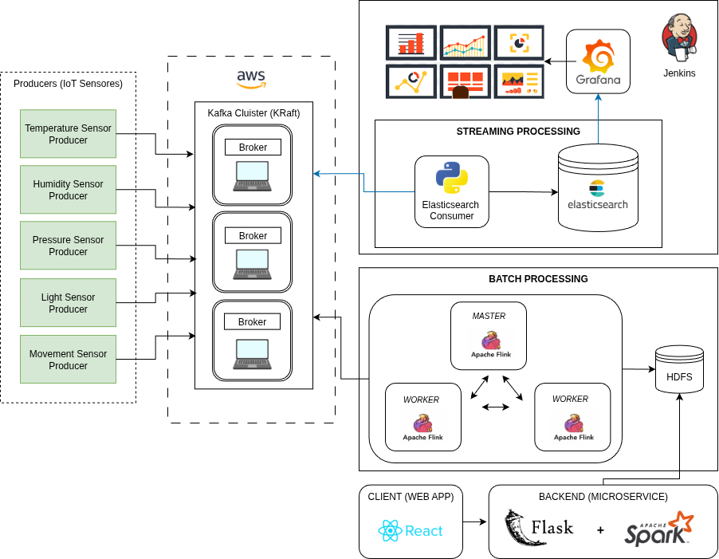
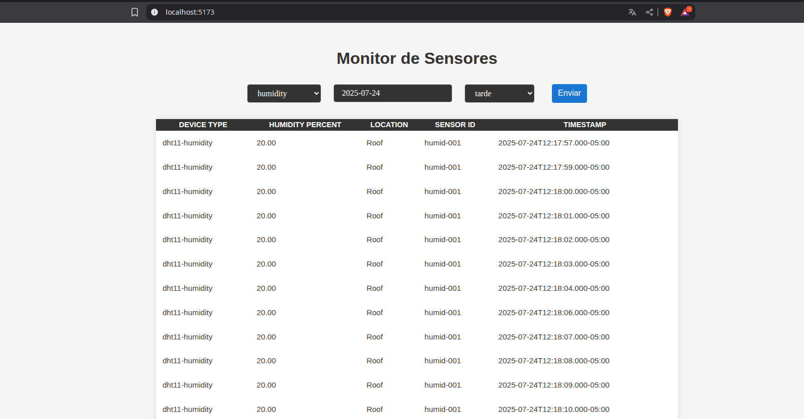

# Pipeline de Datos Distribuido con Kafka + IoT



## 1. Configuración del Clúster Kafka en AWS

### 1.1. Clúster Kafka Kraft con 3 Nodos

- Configuración de un clúster Apache Kafka utilizando **modo Kraft**.
- Se configuraron 3 instancias EC2 (una por nodo).
- Configuraciones clave para cada `server.properties`:

```properties
process.roles=broker,controller
node.id=<ID_UNICO>
controller.quorum.voters=1@<ip1>:9093,2@<ip2>:9093,3@<ip3>:9093
listeners=PLAINTEXT://<ip_local>:9092,CONTROLLER://<ip_local>:9093
listener.security.protocol.map=CONTROLLER:PLAINTEXT,PLAINTEXT:PLAINTEXT
log.dirs=/tmp/kraft-combined-logs
```

### 1.2. Creación de Topics para Sensores

```bash
bin/kafka-topics.sh --create --topic temperature --bootstrap-server <broker-ip>:9092
bin/kafka-topics.sh --create --topic humidity --bootstrap-server <broker-ip>:9092
bin/kafka-topics.sh --create --topic pressure --bootstrap-server <broker-ip>:9092
bin/kafka-topics.sh --create --topic sound --bootstrap-server <broker-ip>:9092
bin/kafka-topics.sh --create --topic light --bootstrap-server <broker-ip>:9092
```

---

## 2. Producers en Python (Sensores desde Raspberry Pi)

Se crearon productores en Python que leen datos desde sensores físicos conectados a una Raspberry Pi, y los publican en Kafka:

```python
from kafka import KafkaProducer
import json
import time
import random  # Simula datos de sensores

producer = KafkaProducer(
    bootstrap_servers='54.144.73.0:9092',
    value_serializer=lambda m: json.dumps(m).encode('utf-8')
)

while True:
    data = {
        'timestamp': time.time(),
        'value': random.uniform(20, 30)
    }
    producer.send('temperature', data)
    time.sleep(1)
```

Se adaptó el código para cada uno de los tópicos (`temperature`, `humidity`, `pressure`, `sound`, `light`).

---

## 3. Procesamiento Streaming

### 3.1. Instalación y Configuración de Elasticsearch

- Versión utilizada: `7.17.15`.
- Ruta de instalación: `/home/hadoop/elasticsearch-7.17.15/`.
- Comando de ejecución:

```bash
cd /home/hadoop/elasticsearch-7.17.15/
./bin/elasticsearch
```

### 3.2. Instalación y Configuración de Grafana

- Versión utilizada: `10.4.2`.
- Ruta de instalación: `/home/hadoop/grafana-v10.4.2/`.
- Comando de ejecución:

```bash
cd /home/hadoop/grafana-v10.4.2/
./bin/grafana-server web
```

- Interfaz accesible en: [http://localhost:3000](http://localhost:3000)

### 3.3. Consumidor de Kafka hacia Elasticsearch (Python)

Script ubicado en: `/home/hadoop/consumerfinal.py`

```python
from kafka import KafkaConsumer
from elasticsearch import Elasticsearch
import json

topics = ['temperature', 'humidity', 'pressure', 'sound', 'light']

consumer = KafkaConsumer(
    *topics,
    bootstrap_servers='54.144.73.0:9092',
    value_deserializer=lambda m: json.loads(m.decode('utf-8')),
    auto_offset_reset='earliest',
    enable_auto_commit=True
)

es = Elasticsearch("http://localhost:9200")

for message in consumer:
    data = message.value
    data['source_topic'] = message.topic
    print(f"Ingresando en Elasticsearch desde [{message.topic}]: {data}")
    es.index(index="iot", body=data)
```

### Activación de Entorno Virtual

Antes de ejecutar el consumidor, se activa el entorno con `pyenv`:

```bash
pyenv activate pyspark-env
python3 /home/hadoop/consumerfinal.py
```

---

## 4. Procesamiento por Lotes

### 4.1. Configuración de Apache Flink (Cluster Local de 3 Nodos)

Se configuró un clúster de Flink de 3 nodos (1 master y 2 workers) en modo local (no distribuido en red) para pruebas de procesamiento batch.

#### Versión utilizada

- Flink 1.17.1

#### Directorio de instalación

- `/home/hadoop/flink-1.17.1/`

#### Configuración de nodos y master

##### En `flink/conf/workers`

```
fedora
paul
aldo-nitro
```

##### En `flink/conf/masters` _(solo en el nodo maestro)_

```
fedora:8081
```

##### Editar `flink/conf/flink-conf.yaml` y ajustar las siguientes variables:

```yaml
# Dirección del JobManager
jobmanager.rpc.address: fedora # O localhost si aplica

# Puerto del JobManager
jobmanager.rpc.port: 6123

# Dirección de enlace del JobManager
jobmanager.bind-host: 0.0.0.0

# Memoria del JobManager
jobmanager.memory.process.size: 1600m

# Dirección de enlace del TaskManager
taskmanager.bind-host: 0.0.0.0

# Dirección del host del TaskManager
taskmanager.host: localhost

# Memoria del TaskManager
taskmanager.memory.process.size: 1728m

# Número de slots por TaskManager
taskmanager.numberOfTaskSlots: 1

# Paralelismo por defecto
parallelism.default: 1

# JARs del pipeline
pipeline.jars: file:///home/hadoop/jars/flink-connector-kafka-1.17.1.jar;file:///home/hadoop/jars/kafka-clients-3.3.2.jar

# Estrategia de tolerancia a fallos
jobmanager.execution.failover-strategy: region

# Configuración del API REST
rest.port: 8081
rest.address: fedora
rest.bind-address: fedora

# Ruta de Python (ajustar según la ruta del entorno en cada nodo)
python.executable: /home/hadoop/.pyenv/versions/pyspark-env/bin/python
```

#### Inicio del clúster

```bash
cd /home/hadoop/flink-1.17.1/
./bin/start-cluster.sh
```

- Interfaz Web: [http://localhost:8081](http://localhost:8081)

---

### 4.2. Configuración de HDFS (Hadoop)

Se configuró HDFS para almacenar los resultados batch.

#### Versión utilizada

- Hadoop 3.3.6

#### Directorio de instalación

- `/home/hadoop/hadoop-3.3.6/`

#### Archivos modificados

##### `core-site.xml`

```xml
<configuration>
  <property>
    <name>fs.defaultFS</name>
    <value>hdfs://localhost:9000</value>
  </property>
</configuration>
```

##### `hdfs-site.xml`

```xml
<configuration>
  <property>
    <name>dfs.replication</name>
    <value>1</value>
  </property>
  <property>
    <name>dfs.namenode.name.dir</name>
    <value>file:///home/hadoop/hadoop-3.3.6/data/namenode</value>
  </property>
  <property>
    <name>dfs.datanode.data.dir</name>
    <value>file:///home/hadoop/hadoop-3.3.6/data/datanode</value>
  </property>
</configuration>
```

##### `mapred-site.xml`

```xml
<configuration>
  <property>
    <name>mapreduce.framework.name</name>
    <value>yarn</value>
  </property>
</configuration>
```

##### `yarn-site.xml` (si se desea usar YARN)

```xml
<configuration>
  <property>
    <name>yarn.nodemanager.aux-services</name>
    <value>mapreduce_shuffle</value>
  </property>
</configuration>
```

#### Formateo e inicio de HDFS

```bash
cd /home/hadoop/hadoop-3.3.6/
./bin/hdfs namenode -format
./sbin/start-dfs.sh
```

- Web UI de HDFS: [http://localhost:9870](http://localhost:9870)

---

### 4.3. Resultados de Procesamiento por Lotes

#### Spark-Streaming

##### Requisitos previos

Asegúrate de haber creado y activado el entorno virtual con `pyenv`, el mismo utilizado en Flink.

```bash
pyenv activate pyspark
```

Instala las dependencias necesarias:

```bash
python3 -m pip install flask flask-cors pyspark
```

##### Ejecución

Ejecuta el backend con Spark:

```bash
spark-submit ./spark.py
```

Esto expondrá el servicio Flask en el puerto `5000`.

##### Realizar consultas

Puedes hacer consultas HTTP al backend mediante la siguiente URL (reemplazando los parámetros según el caso):

```
http://localhost:5000/query?sensor=sound&fecha=2025-07-24&turno=noche
```

- `sensor`: nombre del sensor (por ejemplo, `sound`, `gas`, `humidity`, etc.)
- `fecha`: en formato `YYYY-MM-DD`
- `turno`: puede ser `mañana`, `tarde`, `noche` (sin tilde si se codifica como parámetro URL)

#### Visualización de los resultados - Monitoring-app

##### Requisitos previos

Antes de ejecutar esta aplicación, asegúrate de que el backend en Spark con Flask ya esté corriendo correctamente (Guia en la carpeta Spark).

##### Instalación

Instala las dependencias del frontend:

```bash
npm install
```

##### Ejecución

Inicia el servidor de desarrollo de Vite:

```bash
npm run dev
```

##### Acceso a la aplicación

Una vez iniciado el servidor, abre tu navegador y visita:

[http://localhost:5173/](http://localhost:5173/)



## 5. Automatización con Jenkins (Jenkinsfile)

Pipeline en Jenkins para iniciar Elasticsearch, Grafana y consumidor en paralelo:

```groovy
pipeline {
    agent any

    environment {
        USER_HADOOP = "/home/hadoop/"
    }

    stages {
        stage('Start Services in Parallel') {
            parallel {
                stage('Start Elasticsearch') {
                    steps {
                        sh '''
                            echo "Iniciando Elasticsearch..."
                            cd /home/hadoop/elasticsearch-7.17.15/
                            ./bin/elasticsearch
                        '''
                    }
                }

                stage('Start Grafana') {
                    steps {
                        sh '''
                            echo "Iniciando Grafana..."
                            cd /home/hadoop/grafana-v10.4.2/
                            ./bin/grafana-server web
                        '''
                    }
                }

                stage('Consumer Elasticsearch') {
                    steps {
                        sh '''
                            echo "Activando entorno virtual y lanzando consumidor..."
                            source ~/.bashrc
                            pyenv activate pyspark-env
                            cd /home/hadoop/
                            python3 consumerfinal.py
                        '''
                    }
                }
            }
        }
    }
}
```
